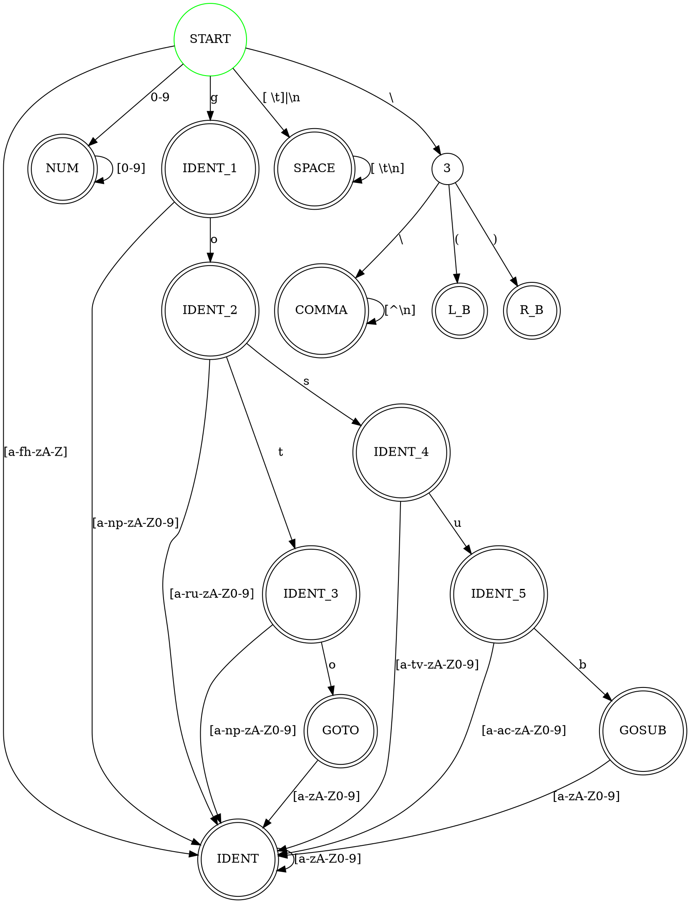

% Лабораторная работа № 1.4 «Лексический распознаватель»
% 13 марта 2024 г.
% Денис Окутин, ИУ9-61Б

# Цель работы
Целью данной работы является изучение использования детерминированных конечных 
автоматов с размеченными заключительными состояниями (лексических распознавателей) 
для решения задачи лексического анализа.

# Индивидуальный вариант
goto, gosub, \(, \), комментарии начинаются с \\ и заканчиваются в конце строки.

# Реализация

Лексическая структура языка — регулярные выражения для доменов:

* IDENT = `[a-zA-Z][a-zA-Z0-9]*`
* NUM = `[0-9]+`
* SPACE = `[ \t]`
* NEW_LINE = `\n`
* GOTO = `goto`
* GOSUB = `gosub`
* L_P = `\\\(`
* R_P = `\\\)`
* COMMA = `\\\\.*` 

Граф детерминированного распознавателя:



Реализация распознавателя:

main.go:
```golang
package main

import (
	"bufio"
	"fmt"
	"log"
	"os"
)

func main() {
	if len(os.Args) < 2 {
		log.Fatal("usage must be: go run main.go <fileTag.txt>\n")
	}
	filePath := os.Args[1]

	file, err := os.Open(filePath)
	if err != nil {
		log.Fatal(err.Error())
	}
	defer file.Close()

	//reader := bufio.NewReaderSize() // для ограничения размера буфера reader`a
	reader := bufio.NewReader(file)

	compiler := NewCompiler()
	scn := NewScanner(reader, &compiler)

	t := scn.NextToken()
	for t.Tag() != EOPTag {
		if t.Tag() != ErrTag {
			fmt.Println(t)
		}
		t = scn.NextToken()
	}
	fmt.Println(t)
	fmt.Println()

	compiler.GetIdentsNames()
	compiler.OutputMessages()
}
```

compiler.go:
```golang
package main

import (
	"fmt"
	"reflect"
	"sort"
)

func SortedMapKeys(m map[Position]Message) (keyList []Position) {
	keys := reflect.ValueOf(m).MapKeys()

	for _, key := range keys {
		keyList = append(keyList, key.Interface().(Position))
	}
	sort.Slice(keyList, func(i, j int) bool {
		return keyList[i].line < keyList[j].line ||
			(keyList[i].line == keyList[j].line && keyList[i].pos < keyList[j].pos)
	})
	return
}

type Compiler struct {
	messages  map[Position]Message
	nameCodes map[string]int
	names     []string
}

func NewCompiler() Compiler {
	return Compiler{nameCodes: make(map[string]int), messages: make(map[Position]Message)}
}

func (c *Compiler) AddName(name string) int {
	if code, ok := c.nameCodes[name]; ok {
		return code
	}
	code := len(c.names)
	c.names = append(c.names, name)
	c.nameCodes[name] = code
	return code
}

func (c *Compiler) Name(code int) string {
	return c.names[code]
}

func (c *Compiler) AddMessage(isErr bool, p Position, text string) {
	c.messages[p] = NewMessage(isErr, text)
}

func (c *Compiler) OutputMessages() {
	list := SortedMapKeys(c.messages)
	for _, key := range list {
		val := c.messages[key]
		if val.isError {
			fmt.Print("Error")
		} else {
			fmt.Print("Warning")
		}
		fmt.Print(" ", key.String(), ": ")
		fmt.Println(val.text)
	}
}
```

fragment.go:
```golang
package main

import "fmt"

type Fragment struct {
	starting  Position
	following Position
}

func NewFragment(starting, following Position) Fragment {
	return Fragment{starting: starting, following: following}
}

func (f Fragment) String() string {
	return fmt.Sprintf("%s-%s", f.starting.String(), f.following.String())
}
```

msg.go:
```golang
package main

type Message struct {
	isError bool
	text    string
}

func NewMessage(isError bool, text string) Message {
	return Message{isError: isError, text: text}
}
```

position.go:
```golang
package main

import (
	"bufio"
	"fmt"
	"unicode"
)

type position struct {
	symb rune
	line int
	pos  int
}

func newPosition(symb rune) position {
	return position{symb: symb, line: 1, pos: 1}
}

type Position struct {
	position
	reader *bufio.Reader
}

func NewPosition(reader *bufio.Reader) Position {
	r, _, err := reader.ReadRune()
	if err != nil {
		r = -1
	}
	return Position{position: newPosition(r), reader: reader}
}

func (p *Position) String() string {
	return fmt.Sprintf("(%d,%d)", p.line, p.pos)
}

func (p *Position) Cp() int {
	return int(p.symb)
}

func (p *Position) IsWhiteSpace() bool {
	return unicode.IsSpace(p.symb)
}

func (p *Position) IsLetter() bool {
	return unicode.IsLetter(p.symb)
}

func (p *Position) IsDigit() bool {
	return unicode.IsDigit(p.symb)
}

func (p *Position) IsLetterOrDigit() bool {
	return unicode.IsLetter(p.symb) || unicode.IsDigit(p.symb)
}

func (p *Position) IsHexagonalNumber() bool {
	return (p.symb >= 'a' && p.symb <= 'f') || (p.symb >= 'A' && p.symb <= 'F') || unicode.IsDigit(p.symb)
}

func (p *Position) IsNewLine() bool {
	return p.symb == '\n'
}

func (p *Position) Next() Position {
	r, _, err := p.reader.ReadRune()
	if err == nil {
		if p.IsNewLine() {
			p.line++
			p.pos = 1
		} else {
			p.pos++
		}
		p.symb = r
	} else {
		p.symb = -1
	}
	return *p
}

func (p *Position) SkipErrors() {
	for !p.IsWhiteSpace() {
		pos := *p
		if p.Next() == pos {
			break
		}
	}
}

func (p *Position) GetSymbol() rune {
	return p.symb
}
```

scanner.go:
```golang
package main

import (
	"bufio"
)

type Scanner struct {
	programReader *bufio.Reader
	compiler      *Compiler
	curPos        Position
	comments      []Fragment
	automata      LexerAutomata
}

func NewScanner(programFile *bufio.Reader, compiler *Compiler) Scanner {
	return Scanner{
		programReader: programFile,
		compiler:      compiler,
		curPos:        NewPosition(programFile),
		automata:      NewLexerAutomata(),
	}
}

func (s *Scanner) NextToken() Token {
	for s.curPos.Cp() != -1 {
		for s.curPos.IsWhiteSpace() {
			s.curPos.Next()
		}
		state := 0
		prevState := 0
		start := s.curPos
		end := Position{}
		curWord := ""
		for state != -1 && s.curPos.Cp() != -1 {
			prevState = state
			state = s.automata.NextState(state, s.curPos)
			if state != -1 {
				end = s.curPos
				curWord += string(rune(s.curPos.Cp()))
				s.curPos.Next()
			}
		}
		if prevState != 0 && prevState != 3 && prevState != 14 {
			return s.chooseToken(prevState, curWord, start, end)
		} else {
			for s.curPos.Cp() != -1 && !s.curPos.IsWhiteSpace() {
				s.curPos.Next()
			}
			s.compiler.AddMessage(true, start, "syntax error")

			return NewErrToken(start, s.curPos).Token
		}
	}

	return NewEOPToken(s.curPos, s.curPos).Token
}

func (s *Scanner) chooseToken(prevState int, curWord string, start, end Position) Token {
	tag := DomainTag(prevState)
	if tag == Ident1Tag || tag == Ident2Tag || tag == Ident3Tag ||
		tag == Ident4Tag || tag == Ident5Tag || tag == IdentTag {
		return NewIdentToken(s.compiler.AddName(curWord), start, end).Token
	}
	if tag == GOSUBTag || tag == GOTOTag {
		return NewSpecToken(tag, curWord, start, end).Token
	}
	if tag == CommaTag {
		s.comments = append(s.comments, NewFragment(start, end))

		return NewCommaToken(start, end, curWord).Token
	}

	return NewToken(DomainTag(prevState), start, end, curWord)
}
```

tag.go:
```golang
package main

type DomainTag int

const (
	ErrTag DomainTag = iota
	IdentTag
	NumTag
	CommaTag DomainTag = iota + 1
	Ident1Tag
	Ident2Tag
	Ident3Tag
	GOTOTag
	Ident4Tag
	Ident5Tag
	GOSUBTag
	LBTag
	RBTag
	EOPTag
)

var tagToString = map[DomainTag]string{
	IdentTag:  "IDENT",
	NumTag:    "NUM",
	GOTOTag:   "GOTO",
	Ident1Tag: "IDENT",
	Ident2Tag: "IDENT",
	Ident3Tag: "IDENT",
	Ident4Tag: "IDENT",
	Ident5Tag: "IDENT",
	LBTag:     "L_B",
	RBTag:     "R_B",
	CommaTag:  "COMMA",
	GOSUBTag:  "GOSUB",
	EOPTag:    "EOP",
	ErrTag:    "ERR",
}
```

tokens.go:
```golang
package main

import (
	"errors"
	"fmt"
	"strconv"
)

var ErrInvalidSpecToken = errors.New("invalid spec token")

type Token struct {
	tag    DomainTag
	coords Fragment
	val    string
}

func NewToken(tag DomainTag, starting, following Position, val string) Token {
	return Token{tag: tag, coords: NewFragment(starting, following), val: val}
}

func (t Token) String() string {
	return fmt.Sprintf("%s %s: %s", tagToString[t.tag], t.coords, t.val)
}

func (t Token) Tag() DomainTag {
	return t.tag
}

type IdentToken struct {
	Token
}

func NewIdentToken(code int, starting, following Position) IdentToken {
	return IdentToken{Token: NewToken(IdentTag, starting, following, strconv.Itoa(code))}
}

type ErrToken struct {
	Token
}

func NewErrToken(starting, following Position) ErrToken {
	return ErrToken{Token: NewToken(ErrTag, starting, following, "")}
}

type NumberToken struct {
	Token
	code int
}

func NewNumberToken(code int, val string, starting, following Position) NumberToken {
	return NumberToken{Token: NewToken(NumTag, starting, following, val), code: code}
}

type EOPToken struct {
	Token
}

func NewEOPToken(starting, following Position) EOPToken {
	return EOPToken{Token: NewToken(EOPTag, starting, following, "")}
}

type CommaToken struct {
	Token
}

func NewCommaToken(starting, following Position, val string) CommaToken {
	return CommaToken{Token: NewToken(CommaTag, starting, following, val[2:])}
}

type SpecToken struct {
	Token
}

func NewSpecToken(tag DomainTag, val string, starting, following Position) SpecToken {
	if tag != GOTOTag && tag != GOSUBTag {
		panic(ErrInvalidSpecToken)
	}
	return SpecToken{Token: NewToken(tag, starting, following, val)}
}
```

automata.go
```go
package main

type LexerAutomata struct {
	automata    [15][14]int
	finalStates []int
}

func NewLexerAutomata() LexerAutomata {
	return LexerAutomata{
		automata: [15][14]int{
			/*     Lt,Nu, g, o, t, s, u, b, \, (,  ),  Sp, \n, X */
			/*0 */ {1, 2, 5, 1, 1, 1, 1, 1, 3, -1, -1, 14, 14, -1},
			/*     Lt,Nu, g, o, t, s, u, b, \, (,   ),  Sp, \n  X */
			/*1 */ {1, 1, 1, 1, 1, 1, 1, 1, -1, -1, -1, -1, -1, -1},
			/*     Lt, Nu, g,  o,  t,  s,  u,  b,  \,  (,   ), Sp, \n, X */
			/*2 */ {-1, 2, -1, -1, -1, -1, -1, -1, -1, -1, -1, -1, -1, -1},
			/*3 */ {-1, -1, -1, -1, -1, -1, -1, -1, 4, 12, 13, -1, -1, -1},
			/*      Lt,Nu,g, o, t, s, u, b, \, (, ),Sp, \n, X */
			/*4 */ {4, 4, 4, 4, 4, 4, 4, 4, 4, 4, 4, 4, -1, 4},
			/*     Lt,Nu, g, o, t, s, u, b, \,  (,  ),  Sp, \n,  X */
			/*5 */ {1, 1, 1, 6, 1, 1, 1, 1, -1, -1, -1, -1, -1, -1},
			/*6 */ {1, 1, 1, 1, 7, 9, 1, 1, -1, -1, -1, -1, -1, -1},
			/*7 */ {1, 1, 1, 8, 1, 1, 1, 1, -1, -1, -1, -1, -1, -1},
			/*8 */ {1, 1, 1, 1, 1, 1, 1, 1, -1, -1, -1, -1, -1, -1},
			/*9 */ {1, 1, 1, 1, 1, 1, 10, 1, -1, -1, -1, -1, -1, -1},
			/*10*/ {1, 1, 1, 1, 1, 1, 1, 11, -1, -1, -1, -1, -1, -1},
			/*11*/ {1, 1, 1, 1, 1, 1, 1, 1, -1, -1, -1, -1, -1, -1},
			/*12*/ {-1, -1, -1, -1, -1, -1, -1, -1, -1, -1, -1, -1, -1, -1},
			/*13*/ {-1, -1, -1, -1, -1, -1, -1, -1, -1, -1, -1, -1, -1, -1},
			/*14*/ {-1, -1, -1, -1, -1, -1, -1, -1, -1, -1, -1, 14, 14, -1},
		},
		finalStates: []int{1, 2, 4, 5, 6, 7, 8, 9, 10, 11, 12, 13, 14},
	}
}

func (a LexerAutomata) NextState(curState int, pos Position) int {
	switch {
	case pos.Cp() == 'g':
		return a.automata[curState][2]
	case pos.Cp() == 'o':
		return a.automata[curState][3]
	case pos.Cp() == 't':
		return a.automata[curState][4]
	case pos.Cp() == 's':
		return a.automata[curState][5]
	case pos.Cp() == 'u':
		return a.automata[curState][6]
	case pos.Cp() == 'b':
		return a.automata[curState][7]
	case pos.Cp() == '\\':
		return a.automata[curState][8]
	case pos.Cp() == '(':
		return a.automata[curState][9]
	case pos.Cp() == ')':
		return a.automata[curState][10]
	case pos.IsLetter():
		return a.automata[curState][0]
	case pos.IsDigit():
		return a.automata[curState][1]
	case pos.IsNewLine():
		return a.automata[curState][12]
	case pos.IsWhiteSpace():
		return a.automata[curState][11]
	default:
		return a.automata[curState][13]
	}
}
```

# Тестирование

Входные данные

```
\\ comma^%
& test goto
 \ \(gosub\)
```

Вывод на `stdout`

```
COMMA (1,1)-(1,10):  comma^%
IDENT (2,3)-(2,6): 0
GOTO (2,8)-(2,11): goto
L_B (3,4)-(3,5): \(
GOSUB (3,6)-(3,10): gosub
R_B (3,11)-(3,12): \)
EOP (3,12)-(3,12): 

IDENTs:
0: test

Error (2,1): syntax error
Error (3,2): syntax error
```

# Вывод
В ходе проведенной работы было проведено тщательное изучение и анализ
использования детерминированных конечных автоматов с размеченными заключительными
состояниями в качестве лексических распознавателей. Было подтверждено, 
что такие автоматы эффективны для решения задач лексического анализа, 
поскольку они позволяют точно и эффективно идентифицировать лексемы, 
что является первым и критически важным шагом в процессе компиляции 
и интерпретации программного кода.

Практическая часть работы включала разработку лексического распознавателя на языке Golang
для определенного набора лексических правил, что позволило продемонстрировать
применимость теоретических положений на практике. Был использован каркас для лексического 
анализатора из прошлой лабораторной работы, что несомненно сэкономило несколько часов разработки,
а т.к был написан хороший анализатор в прошлой лабе, то проблем с интеграцией с автоматом не возникло.

В ходе лабораторной работы вспомнил синтаксис описания автомата в dot, получился достаточно внушительный,
на первый взгляд, автомат, которым можно пугать одногруппников, которые ещё не преступали к лабе :).
Хотя это далеко не самый страшный автомат, который мне доводилось видеть.